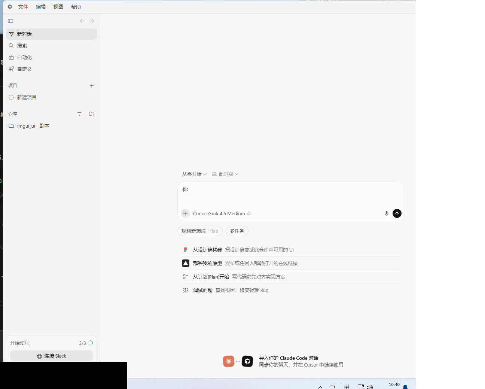

# Cursor 一键汉化（Windows）

给 [Cursor](https://cursor.com) 做完整的简体中文界面汉化：**下载本仓库 → 双击 `一键汉化.bat` → 完成**。



## 它解决什么问题

Cursor 的界面分两层，官方都没有完整中文支持：

| 层 | 内容 | 谁来翻译 |
|----|------|----------|
| 编辑器底座 | 菜单、命令面板、IDE 设置、提示 | 微软官方 [中文语言包](https://marketplace.visualstudio.com/items?itemName=MS-CEINTL.vscode-language-pack-zh-hans) |
| Cursor 自有界面 | Agents 侧栏（New Chat / Automations…）、Cursor 设置页、聊天气泡、按钮等 | 微软语言包**管不到**，官方暂未支持中文（[论坛讨论](https://forum.cursor.com/t/please-add-chinese-support-for-the-agents-window/161942)），由开源扩展 [ggbdpq/cursor-language-pack-zh-hans](https://open-vsx.org/extension/ggbdpq/cursor-language-pack-zh-hans) 补齐 |

本仓库把两者打包成**一键脚本**，并在该扩展之上做了四点增强：

1. **修复扫描盲区**：原版翻译引擎只扫描启动时已存在、且位于预设区域内的界面，
   导致侧栏这类「启动后才异步挂载」的界面永远保持英文。本项目把整个页面
   纳入扫描根与实时监听区（编辑器、终端、代码块仍受原版禁区保护，不会误翻）。
2. **修复菜单栏不翻译**：VS Code 菜单标题因助记符渲染被拆成
   `<mnemonic>F</mnemonic>ile` 的多个文本节点，逐节点匹配永远打不中词典。
   引擎获得「分组文本回退」能力：父元素整体文本命中词典时整体替换，
   菜单栏（文件/编辑/选择/视图/转到/终端/帮助）由此变中文。
3. **启动竞态兜底**：大纲、标签页等面板在初始扫描与监听生效之间的窗口期
   挂载或被模型重写为英文后会永久停留。启动后延迟补扫两轮覆盖该窗口。
4. **补齐词典**：原版词典跟不上 Cursor 版本迭代，本项目补充了 Cursor 3.20
   新增文案、IDE 专属文案等 44 条翻译（合计 1552 条，
   见 [`scripts/dict/extras.json`](scripts/dict/extras.json)），欢迎 PR 继续補。

## 环境要求

- Windows 10 / 11
- [Cursor](https://cursor.com) 已安装
- Node.js ≥ 18（没装也没关系：`一键汉化.bat` 会尝试用 winget 自动安装，或去 [nodejs.org](https://nodejs.org/zh-cn) 手动装）

## 使用方法

**方式一（推荐）**：打开本仓库 → 绿色 `Code` 按钮 → `Download ZIP` → 解压 → 双击 **`一键汉化.bat`**

**方式二**：

```bat
git clone https://github.com/<你的用户名>/cursor-one-click-chinese.git
cd cursor-one-click-chinese
一键汉化.bat
```

脚本会自动完成：

1. 检测 Cursor 安装位置
2. （如正在运行）关闭 Cursor
3. 安装微软官方中文语言包
4. 显示语言设为 `zh-cn`
5. 从 open-vsx 下载并安装「Cursor 专有界面汉化」扩展（固定版本 `0.0.11`，与本项目补丁严格匹配）
6. 给翻译引擎打增强补丁（修改前自动留 `.orig-backup` 备份）
7. 应用汉化（上游 1508 条 + 本项目补充词典）
8. 重新启动 Cursor

**换新电脑？** 装好 Cursor 和 Node.js，重复上面步骤即可，所有配置随脚本自动完成。

## Cursor 更新后界面变回英文了？

Cursor 每次升级会覆盖程序文件，汉化随之失效。**重新运行 `一键汉化.bat` 即可**（脚本可重复执行，自动还原旧补丁再打新的）。

## 恢复英文界面

双击 **`恢复英文.bat`**，或卸载「Cursor 专有界面汉化」扩展（它会自动还原补丁）。
若连菜单里的中文也不想要，把 `~/.cursor/argv.json` 里的 `"locale"` 改回 `"en"`。

## 常见问题

- **双击 BAT 后窗口一闪而过 / 闪退？**
  旧版本 BAT 文件是 LF 换行，部分中文系统上 cmd 无法解析导致闪退，**已修复为 CRLF**——请重新下载最新版仓库。
  若仍闪退：右键「在终端中打开」，手动运行 `node scripts\install.mjs` 查看具体报错，欢迎带截图提 Issue。
- **没有 Node.js 会不会闪退？**
  不会。脚本会先检测 Node.js，没有时尝试用 winget 自动安装；安装失败也会停在窗口里给出手动安装指引。
- **我的 Cursor 装在非默认目录怎么办？**
  脚本会依次尝试：PATH 中的 cursor 命令 → 注册表（HKCU/HKLM 安装记录）→ 常见安装路径。
  都找不到时会**交互式询问**你安装目录（粘贴含 Cursor.exe 的文件夹即可），
  也可以直接传参：`一键汉化.bat "D:\你的目录\cursor"` 或 `node scripts\install.mjs --dir="D:\你的目录\cursor"`。
- **支持哪些 Cursor 版本？**
  面向 Cursor 3.x（词典在 3.14+ 上验证）。脚本对引擎补丁做了锚点兼容处理，结构对不上时会警告并跳过（不影响其余步骤）。
- **为什么有些地方还是英文？**
  模型名（如 `Claude Opus 5.5`）、账号名、仓库名、品牌词保持原文是正常设计。
  其他漏翻欢迎提 Issue / PR（在 `scripts/dict/extras.json` 加一条即可）。
- **杀毒软件报警？**
  脚本的行为是「下载扩展 + 修改 Cursor 安装目录内的两个文件 + 重启进程」，属于补丁类工具的正常操作，
  代码全部开源可审，介意可先阅读 `scripts/install.mjs` 再运行。
- **支持 macOS / Linux 吗？**
  仅适配 Windows。上游扩展本身有 macOS（beta）支持，理论上可参考其文档手动操作，本仓库的脚本暂未适配。
- **安全吗？会不会上传我的代码？**
  不会。全部操作都在本机完成，唯一联网动作是从 open-vsx.org 下载语言包扩展。
  「Cursor 专有界面汉化」扩展本身经审查无网络行为（本地词典替换实现）。

## 项目结构

```
cursor-one-click-chinese/
├── 一键汉化.bat            # 双击运行：自动装 Node（可选）→ 调用安装脚本
├── 恢复英文.bat            # 双击运行：还原 Cursor 原始文件
├── scripts/
│   ├── install.mjs         # 安装主流程（8 步，见上文）
│   ├── restore.mjs         # 恢复英文
│   └── dict/extras.json    # 本项目补充词典（欢迎 PR）
└── assets/screenshot.png   # 效果截图
```

## 工作原理（给想看代码的你）

微软语言包负责 VS Code 底座（NLS 机制）；「Cursor 专有界面汉化」扩展的原理是：
向 `resources/app/out/vs/workbench/` 写入翻译后的 workbench 副本（`*_translated.js`），
并注入一个 DOM 文本替换引擎（`cursor.inject.js`），按词典对界面文本做精确匹配替换。
它自带备份、失败回滚和 `product.json` 校验和同步（避免 Cursor 弹「安装已损坏」警告）。
本项目脚本通过该扩展导出的 `applyPatch / revertPatch` 接口工作，
只是在其词典里合入补充条目、并对其引擎做两处小补丁。

## 致谢与许可

- [ggbdpq/cursor-loc](https://github.com/ggbdpq/cursor-loc)（MIT）—— Cursor 专有界面汉化扩展与补丁引擎
- [MS-CEINTL.vscode-language-pack-zh-hans](https://github.com/microsoft/vscode-loc)（MIT）—— 微软官方简体中文语言包
- 本项目代码以 [MIT](LICENSE) 开源。

> 免责声明：本项目是社区汉化工具，与 Cursor（Anysphere）官方无关；Cursor 大版本更新可能使补丁暂时失效。
